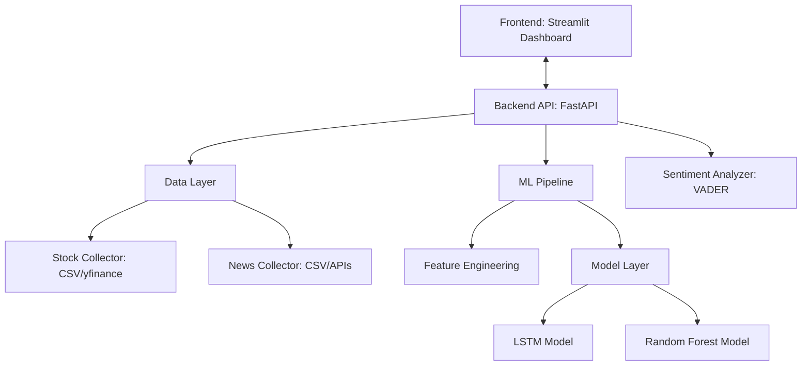
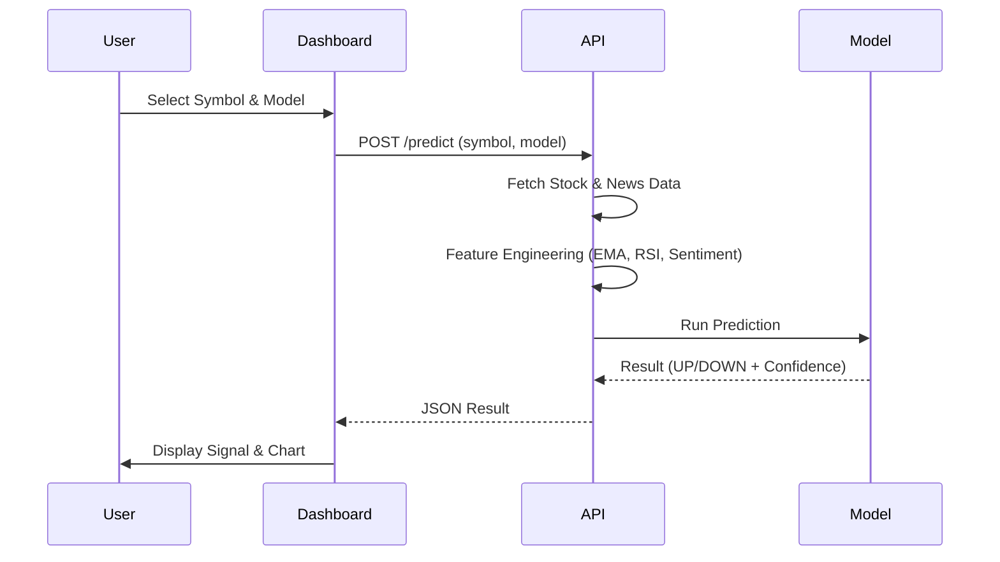
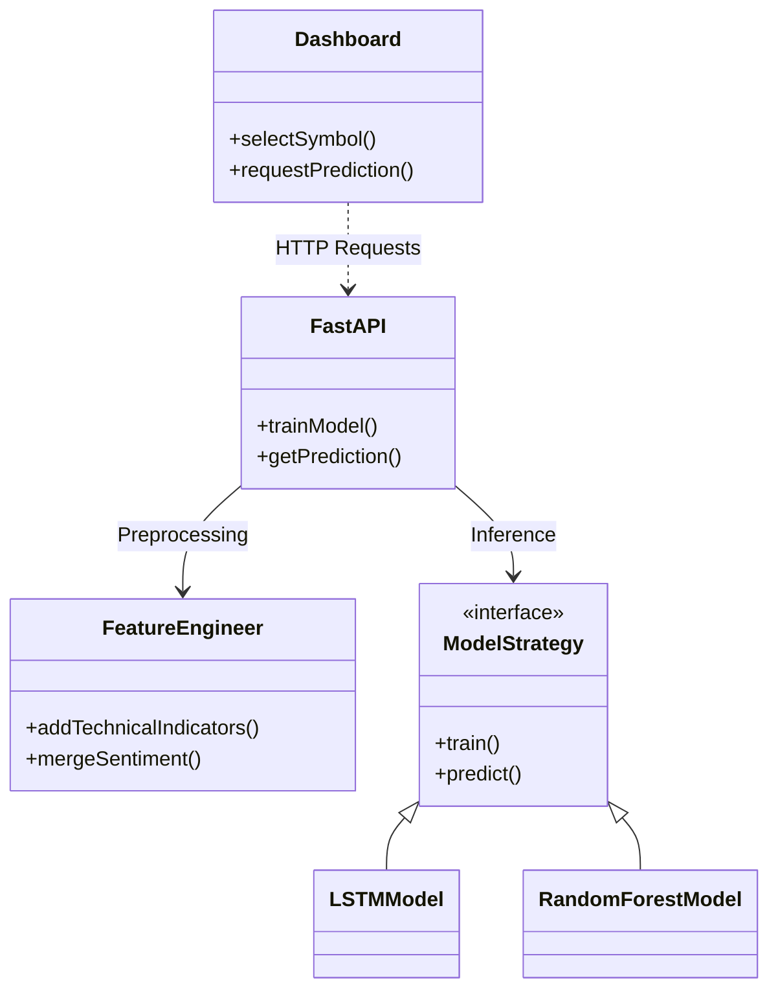
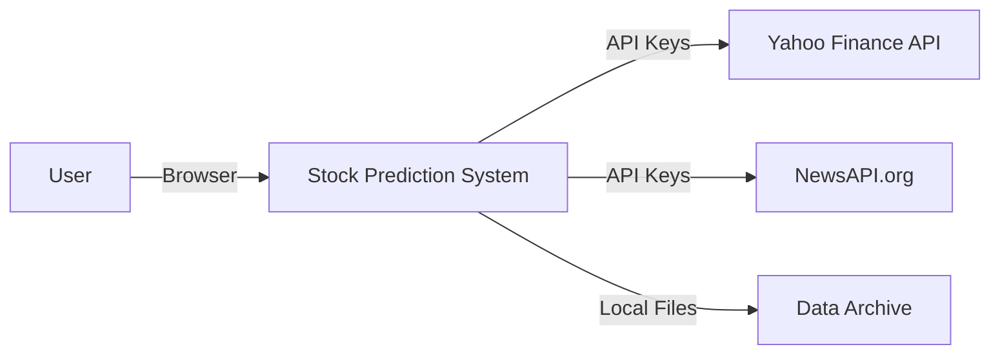

# Stock Price Prediction & Sentiment Analysis System

An end-to-end data-driven stock price prediction system that combines Technical Analysis (EMA, MACD, Bollinger Bands) with NLP-based Sentiment Analysis. Supporting major US and Indian market indices.

## 🚀 Features & Benefits

### Features
- **Multi-Asset Support**: Predict for AAPL, MSFT, GOOGL and Indian Indices like NIFTY 50, SENSEX, NIFTY BANK, NIFTY IT.
- **Hybrid Intelligence**: Combines technical indicators with market sentiment for holistic analysis.
- **Robust Model Options**: Toggle between **LSTM (Recurrent Neural Network)** for sequence learning and **Random Forest** for stable classification.
- **Interactive Dashboard**: Streamlit-based UI for real-time visualization and on-demand predictions.
- **Advanced Indicators**: Built-in support for EMA, MACD, RSI, and Bollinger Bands.

### Benefits
- **Better Decision Making**: Signals are backed by both math (Technical) and context (Sentiment).
- **Reduced Risk**: Multi-model verification helps identify high-confidence trades.
- **Actionable Insights**: Clear BUY/SELL/HOLD recommendations with confidence percentages.
- **Scalable Architecture**: Loosely coupled design allows easy integration of new models or data sources.

---

## 🏗 System Architecture

### 1. Overall System Integration Diagram

### 2. Process Flow Diagram

### 3. Component Interaction Diagram

### 4. External System Interaction (Future Readiness)

---

## 🛠 Installation & Usage

The system is managed via the enterprise `manage.sh` script:

1. **Start System**: `./manage.sh start`
2. **Access Dashboard**: `http://localhost:8501`
3. **View Logs**: `./manage.sh logs`
4. **Stop System**: `./manage.sh stop`
5. **Check Status**: `./manage.sh status`

---

## 📂 Project Structure
- `com.stockprediction.backend`: FastAPI service and ML implementations.
- `com.stockprediction.frontend`: Streamlit dashboard.
- `data/`: CSV datasets for stocks and news.
- `scripts/`: Data generation and utility scripts.
- `tests/`: Automated backend verification tests.
